# 1 基于rancher构建容器平台

Rancher是Kubernetes管理工具，它可以轻松部署新K8S集群，启动EKS、GKE和AKS集群，甚至导入现有的Kubernetes集群。

[Rancher 2.0-CN](https://www.cnrancher.com/docs/rancher/v2.x/cn/overview/)


## 1.1 前提条件

[基础环境准备](./docker-environment-building.md)

## 1.2 rancher安装
这里默认使用rancher的最新版本...
```
sudo docker run -d --restart=always -p 80:80 -p 443:443 rancher/rancher:latest
```
在浏览器里面访问
```
https://IP
```
设置密码
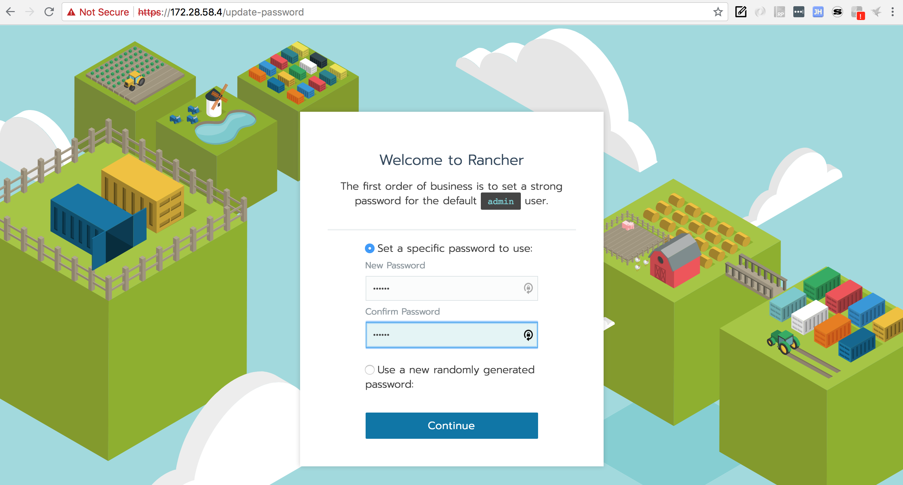

默认Rancher Server URL即可
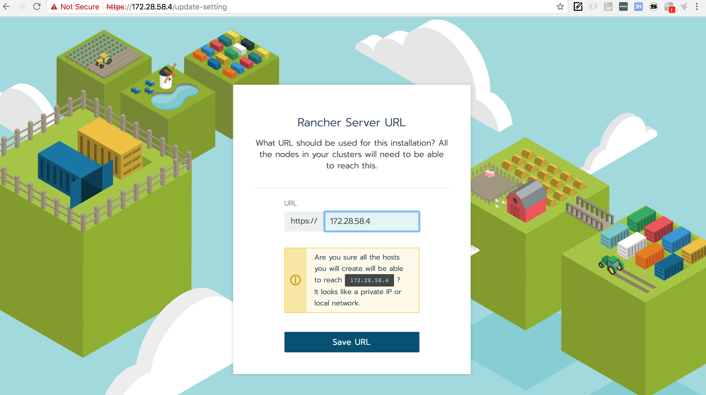

点击Continue完成。

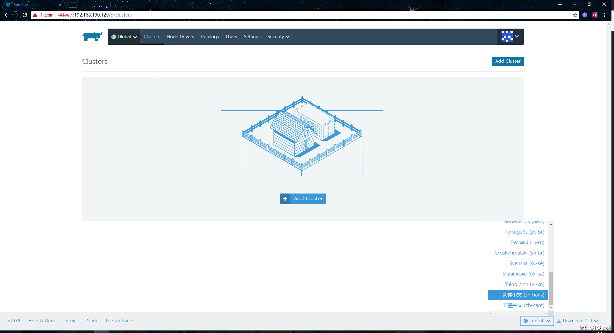

## 1.3 添加k8s集群

这里共有两台主机(两个节点)

点击添加`集群按钮`，选择`custom`，按照下图填写配置：

* 集群名称
* Kubernetes的版本
* 网络组件
* 其他选项，选择默认值

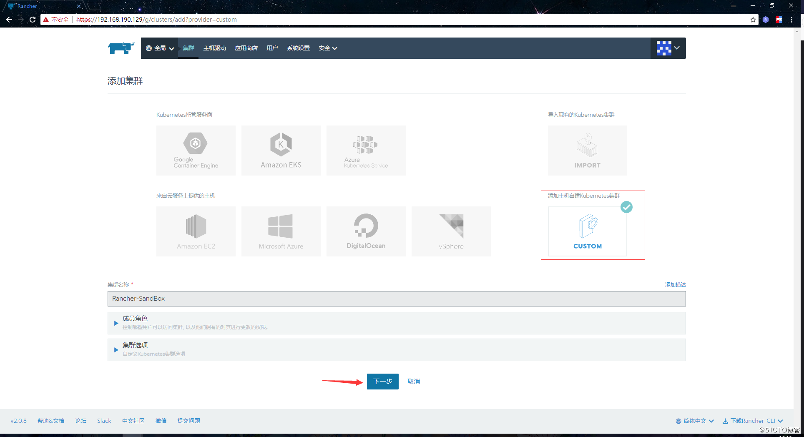

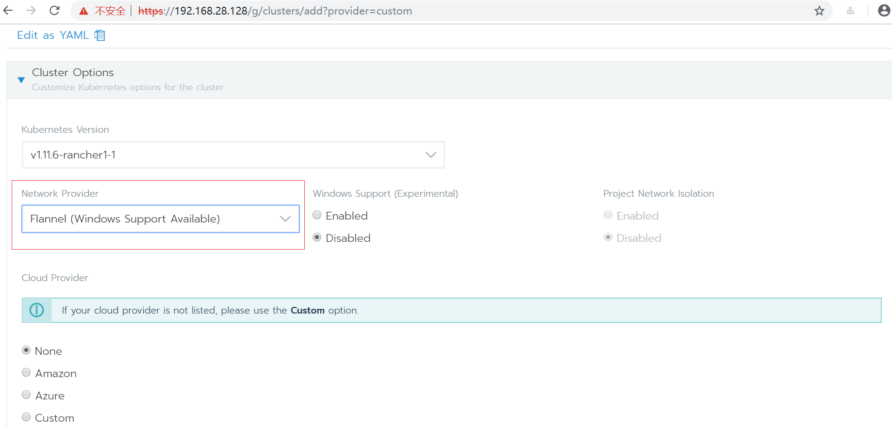

配置主机的及角色地址，这个主机也就是rancher agent：
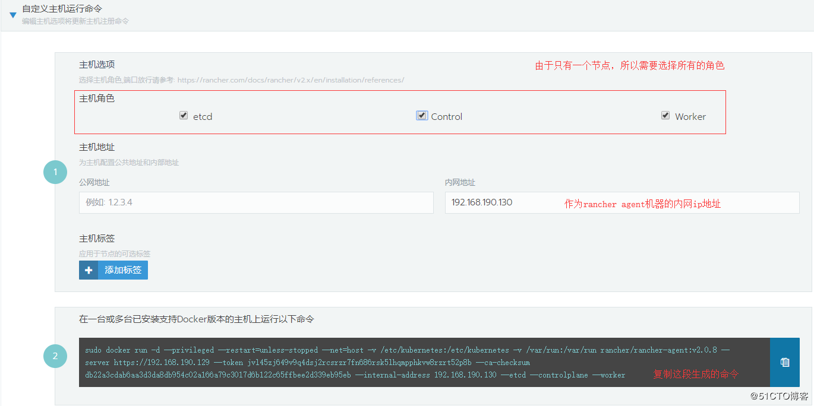

```
注：如果是多台主机，根据角色的不同，需要复制多次命令
```
在节点1上勾选etcd/Control/Worker，生成脚本后在节点1上执行。

在节点2上勾选Worker，上传脚本后再节点2上执行。

执行成功后，页面下方会显示新主机注册成功：
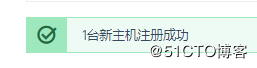

经过一段等待后，主机注册成功，转换为可用状态：
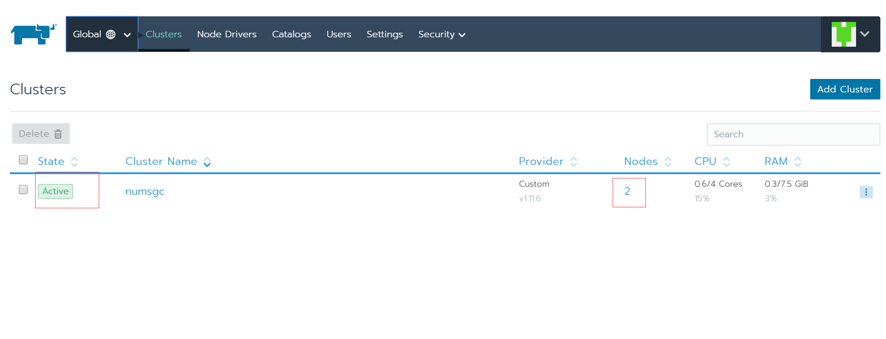

点击集群也能够看到集群的仪表盘信息了：


安装完Rancher 2.0后, 你需要进一步进行系统配置：

### 1.4 配置AD认证 

Rancher可以设置为仅允许一组活动目录用户和组访问。当前系统未设置，任何能够访问此页面或API的用户拥有对Rancher的完全控制权限。

从`"安全"->"认证"`菜单，进入配置页面，所填信息如下：

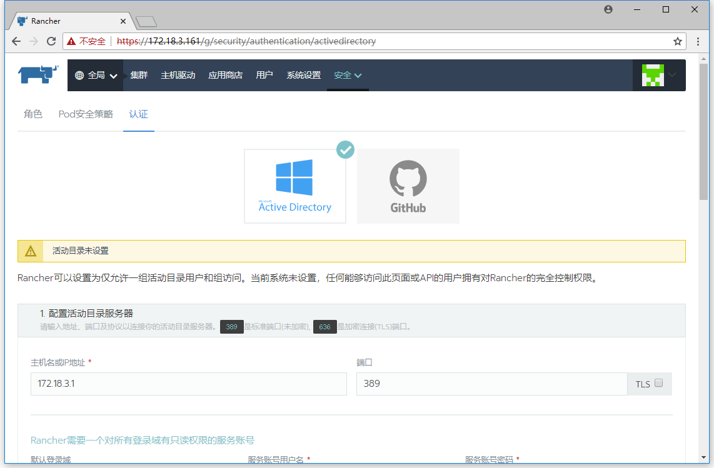

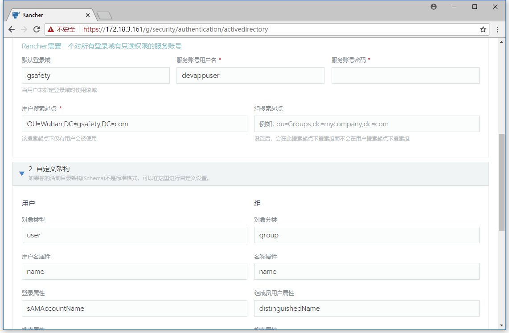

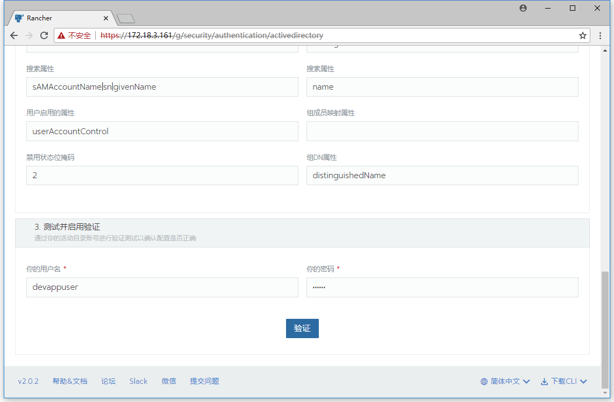

点击验证，成功后保存设置。

### 1.5 配置用户角色

在Rancher中，每个人都以用户身份进行身份验证这是一个允许您访问Rancher的登录信息。如Authentication中所述，用户可以是本地的也可以是外部的。

配置外部身份验证后，用户页面上显示的用户将更改。

* 如果以本地用户身份登录，则只显示本地用户。
* 如果以外部用户登陆，则会显示外部用户和本地用户。

一旦用户登录到Rancher，他们的认证或他们在系统中的访问权限由 `全局权限` 和 `集群和项目角色` 决定。

* 全局权限  
在特定集群的范围之外定义用户授权。

* 集群和项目角色  
在为其分配角色的特定集群或项目中定义用户授权。

全局权限以及集群和项目角色都在Kubernetes RBAC之上实现。

### 1.6 为项目添加成员

项目须由项目所有者创建，成员由项目所有者添加。

项目权限有以下几种：

* 所有者  
所有者可以完全控制Project及内部的所有资源。

* 成员  
成员可以管理Project内部的资源，但不能更改Project本身。

* 只读  
成员仅可以查看Project中的资源，但不能更改资源和Project本身。

* 自定义  
为用户选择单个角色


